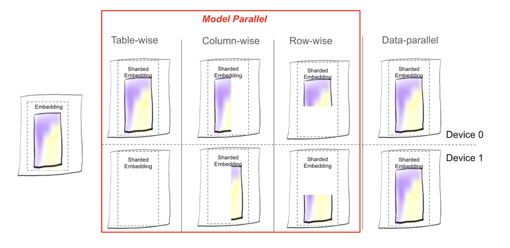
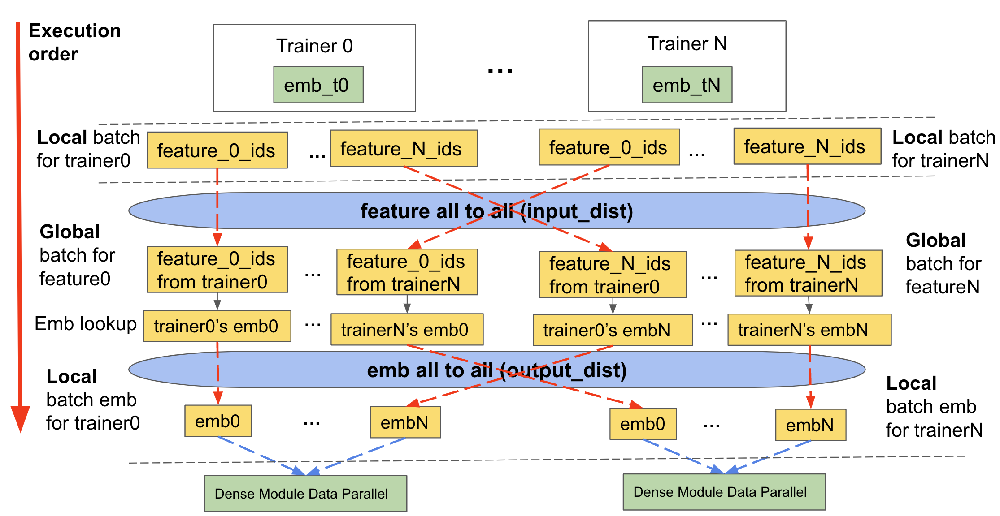
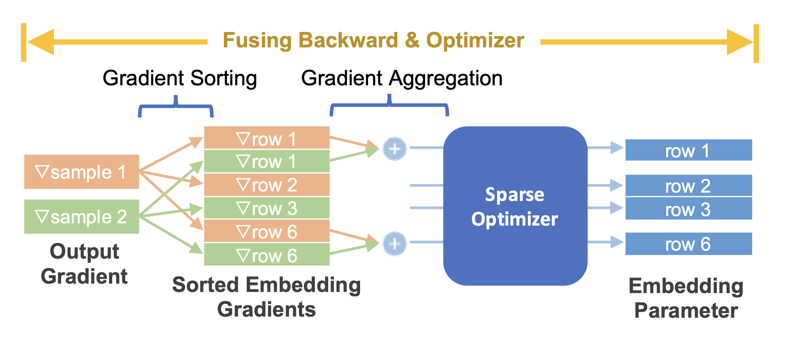

.. meta::
   :description: TorchRec Concepts
   :keywords: recommendation systems, sharding, distributed training, torchrec, embedding bags, embeddings, keyedjaggedtensor, row wise, table wise, column wise, table row wise, planner, sharder

###################
TorchRec Concepts
###################

In this section, we will learn about the key concepts of TorchRec,
designed to optimize large-scale recommendation systems using PyTorch.
We will learn how each concept works in detail and review how it is used
with the rest of TorchRec.

TorchRec has specific input/output data types of its modules to
efficiently represent sparse features, including:

-  **JaggedTensor:** a wrapper around the lengths/offsets and values
   tensors for a singular sparse feature.
-  **KeyedJaggedTensor:** efficiently represent multiple sparse
   features, can think of it as multiple ``JaggedTensor``\s.
-  **KeyedTensor:** a wrapper around ``torch.Tensor`` that allows access
   to tensor values through keys.

With the goal of high performance and efficiency, the canonical
``torch.Tensor`` is highly inefficient for representing sparse data.
TorchRec introduces these new data types because they provide efficient
storage and representation of sparse input data. As you will see later
on, the ``KeyedJaggedTensor`` makes communication of input data in a
distributed environment very efficient leading to one of the key
performance advantages that TorchRec provides.

In the end-to-end training loop, TorchRec comprises of the following
main components:

-  **Planner:** Takes in the configuration of embedding tables,
   environment setup, and generates an optimized sharding plan for the
   model.

-  **Sharder:** Shards model according to sharding plan with different
   sharding strategies including data-parallel, table-wise, row-wise,
   table-wise-row-wise, column-wise, and table-wise-column-wise
   sharding.

-  **DistributedModelParallel:** Combines sharder, optimizer, and
   provides an entry point into the training the model in a distributed
   manner.

**************
JaggedTensor
**************

A ``JaggedTensor`` represents a sparse feature through lengths, values,
and offsets. It is called "jagged" because it efficiently represents
data with variable-length sequences. In contrast, a canonical
``torch.Tensor`` assumes that each sequence has the same length, which
is often not the case with real world data. A ``JaggedTensor``
facilitates the representation of such data without padding making it
highly efficient.

Key Components:

-  ``Lengths``: A list of integers representing the number of elements
   for each entity.

-  ``Offsets``: A list of integers representing the starting index of
   each sequence in the flattened values tensor. These provide an
   alternative to lengths.

-  ``Values``: A 1D tensor containing the actual values for each entity,
   stored contiguously.

Here is a simple example demonstrating how each of the components would
look like:

.. code:: python

   # User interactions:
   # - User 1 interacted with 2 items
   # - User 2 interacted with 3 items
   # - User 3 interacted with 1 item
   lengths = [2, 3, 1]
   offsets = [0, 2, 5]  # Starting index of each user's interactions
   values = torch.Tensor([101, 102, 201, 202, 203, 301])  # Item IDs interacted with
   jt = JaggedTensor(lengths=lengths, values=values)
   # OR
   jt = JaggedTensor(offsets=offsets, values=values)

*******************
KeyedJaggedTensor
*******************

A ``KeyedJaggedTensor`` extends the functionality of ``JaggedTensor`` by
introducing keys (which are typically feature names) to label different
groups of features, for example, user features and item features. This
is the data type used in ``forward`` of ``EmbeddingBagCollection`` and
``EmbeddingCollection`` as they are used to represent multiple features
in a table.

A ``KeyedJaggedTensor`` has an implied batch size, which is the number
of features divided by the length of ``lengths`` tensor. The example
below has a batch size of 2. Similar to a ``JaggedTensor``, the
``offsets`` and ``lengths`` function in the same manner. You can also
access the ``lengths``, ``offsets``, and ``values`` of a feature by
accessing the key from the ``KeyedJaggedTensor``.

.. code:: python

   keys = ["user_features", "item_features"]
   # Lengths of interactions:
   # - User features: 2 users, with 2 and 3 interactions respectively
   # - Item features: 2 items, with 1 and 2 interactions respectively
   lengths = [2, 3, 1, 2]
   values = torch.Tensor([11, 12, 21, 22, 23, 101, 201, 202])
   # Create a KeyedJaggedTensor
   kjt = KeyedJaggedTensor(keys=keys, lengths=lengths, values=values)
   # Access the features by key
   print(kjt["user_features"])
   # Outputs user features
   print(kjt["item_features"])

*********
Planner
*********

The TorchRec planner helps determine the best sharding configuration for
a model. It evaluates multiple possibilities for sharding embedding
tables and optimizes for performance. The planner performs the
following:

-  Assesses the memory constraints of the hardware.
-  Estimates compute requirements based on memory fetches, such as
   embedding lookups.
-  Addresses data-specific factors.
-  Considers other hardware specifics, such as bandwidth, to generate an
   optimal sharding plan.

To ensure accurate consideration of these factors, the Planner can
incorporate data about the embedding tables, constraints, hardware
information, and topology to help in generating an optimal plan.

*****************************
Sharding of EmbeddingTables
*****************************

TorchRec sharder provides multiple sharding strategies for various use
cases, we outline some of the sharding strategies and how they work as
well as their benefits and limitations. Generally, we recommend using
the TorchRec planner to generate a sharding plan for you as it will find
the optimal sharding strategy for each embedding table in your model.

Each sharding strategy determines how to do the table split, whether the
table should be cut up and how, whether to keep one or a few copies of
some tables, and so on. Each piece of the table from the outcome of
sharding, whether it is one embedding table or part of it, is referred
to as a shard.

   *Figure 1: Visualizing the placement of table shards under different sharding schemes offered in TorchRec*

Here is the list of all sharding types available in TorchRec:

-  Table-wise (TW): as the name suggests, embedding table is kept as a
   whole piece and placed on one rank.

-  Column-wise (CW): the table is split along the ``emb_dim`` dimension,
   for example, ``emb_dim=256`` is split into 4 shards: ``[64, 64, 64,
   64]``.

-  Row-wise (RW): the table is split along the ``hash_size`` dimension,
   usually split evenly among all the ranks.

-  Table-wise-row-wise (TWRW): table is placed on one host, split
   row-wise among the ranks on that host.

-  Grid-shard (GS): a table is CW sharded and each CW shard is placed
   TWRW on a host.

-  Data parallel (DP): each rank keeps a copy of the table.

Once sharded, the modules are converted to sharded versions of
themselves, known as ``ShardedEmbeddingCollection`` and
``ShardedEmbeddingBagCollection`` in TorchRec. These modules handle the
communication of input data, embedding lookups, and gradients.

****************************************************
Distributed Training with TorchRec Sharded Modules
****************************************************

With many sharding strategies available, how do we determine which one
to use? There is a cost associated with each sharding scheme, which in
conjunction with model size and number of GPUs determines which sharding
strategy is best for a model.

Without sharding, where each GPU keeps a copy of the embedding table
(DP), the main cost is computation in which each GPU looks up the
embedding vectors in its memory in the forward pass and updates the
gradients in the backward pass.

With sharding, there is an added communication cost: each GPU needs to
ask the other GPUs for embedding vector lookup and communicate the
gradients computed as well. This is typically referred to as ``all2all``
communication. In TorchRec, for input data on a given GPU, we determine
where the embedding shard for each part of the data is located and send
it to the target GPU. That target GPU then returns the embedding vectors
back to the original GPU. In the backward pass, the gradients are sent
back to the target GPU and the shards are updated accordingly with the
optimizer.

As described above, sharding requires us to communicate the input data
and embedding lookups. TorchRec handles this in three main stages, we
will refer to this as the sharded embedding module forward that is used
in training and inference of a TorchRec model:

-  Feature All to All/Input distribution (``input_dist``)

   -  Communicate input data (in the form of a ``KeyedJaggedTensor``) to
      the appropriate device containing relevant embedding table shard

-  Embedding Lookup

   -  Lookup embeddings with new input data formed after feature all to
      all exchange

-  Embedding All to All/Output Distribution (``output_dist``)

   -  Communicate embedding lookup data back to the appropriate device
      that asked for it (in accordance with the input data the device
      received)

-  The backward pass does the same operations but in reverse order.

The diagram below demonstrates how it works:

   *Figure 2: Forward pass of a table wise sharded table including the input_dist, lookup, and output_dist of a sharded TorchRec module*

**************************
DistributedModelParallel
**************************

All of the above culminates into the main entrypoint that TorchRec uses
to shard and integrate the plan. At a high level,
``DistributedModelParallel`` does the following:

-  Initializes the environment by setting up process groups and
   assigning device type.

-  Uses default sharders if no sharders are provided, the default includes
   ``EmbeddingBagCollectionSharder``.

-  Takes in the provided sharding plan, if none is provided, it
   generates one.

-  Creates a sharded version of modules and replaces the original
   modules with them, for example, converts ``EmbeddingCollection`` to
   ``ShardedEmbeddingCollection``.

-  By default, wraps the ``DistributedModelParallel`` with
   ``DistributedDataParallel`` to make the module both model and data
   parallel.

***********
Optimizer
***********

TorchRec modules provide a seamless API to fuse the backwards pass and
optimizer step in training, providing a significant optimization in
performance and decreasing the memory used, alongside granularity in
assigning distinct optimizers to distinct model parameters.

   *Figure 3: Fusing embedding backward with sparse optimizer*

***********
Inference
***********

Inference environments are different from training, they are very
sensitive to performance and the size of the model. There are two key
differences TorchRec inference optimizes for:

-  **Quantization:** inference models are quantized for lower latency
   and reduced model size. This optimization lets us use as few devices
   as possible for inference to minimize latency.

-  **C++ environment:** to minimize latency even further, the model is
   ran in a C++ environment.

TorchRec provides the following to convert a TorchRec model into being
inference ready:

-  APIs for quantizing the model, including optimizations automatically
   with FBGEMM TBE
-  Sharding embeddings for distributed inference
-  Compiling the model to TorchScript (compatible in C++)

*********
See Also
*********

-  `TorchRec Interactive Notebook using the concepts
   <https://github.com/pytorch/torchrec/blob/main/TorchRec_Interactive_Tutorial_Notebook_OSS_version.ipynb>`_
