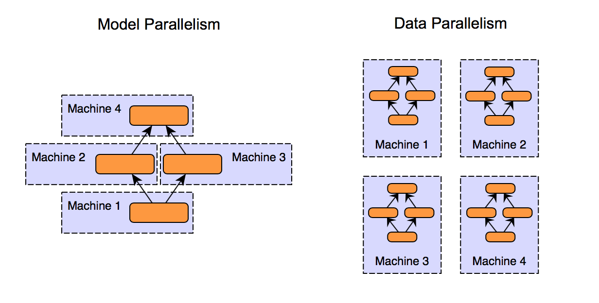
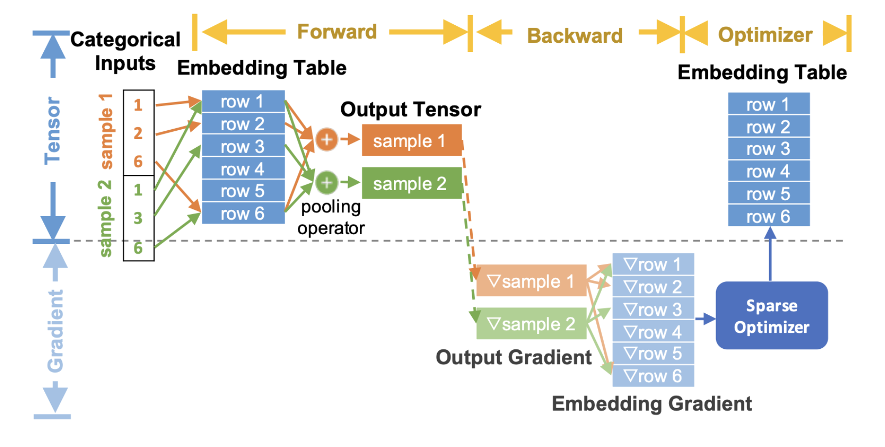

.. meta::
   :description: TorchRec High Level Architecture
   :keywords: recommendation systems, sharding, distributed training, torchrec, architecture

##################################
 TorchRec High Level Architecture
##################################

In this section, you will learn about the high-level architecture of
TorchRec, designed to optimize large-scale recommendation systems using
PyTorch. You will learn how TorchRec employs model parallelism to
distribute complex models across multiple GPUs, enhancing memory
management and GPU utilization, as well as get introduced to TorchRec's
base components and sharding strategies.

In effect, TorchRec provides parallelism primitives allowing hybrid data
parallelism/model parallelism, embedding table sharding, planner to
generate sharding plans, pipelined training, and more.

****************************************************
 TorchRec's Parallelism Strategy: Model Parallelism
****************************************************

As modern deep learning models have scaled, distributed deep learning
has become required to successfully train models in sufficient time. In
this paradigm, two main approaches have been developed: data parallelism
and model parallelism. TorchRec focuses on the latter for the sharding
of embedding tables.

   *Figure 1. Comparison between model parallelism and data parallelism approach*

As you can see in the diagram above, model parallelism and data
parallelism are two approaches to distribute workloads across multiple
GPUs,

-  **Model Parallelism**

   -  Divide the model into segments and distribute them across GPUs
   -  Each segment processes data independently
   -  Suitable for lage models that don't fit on a single GPU

-  **Data Parallel**

   -  Distribute the copies of entire model on each GPU
   -  Each GPU processes a subset of the data and contributes to the
      overall computation
   -  Effecive for models that fit on single GPU but need to handle
      large datasets

-  **Benefits of Model Parallelism**

   -  Optimizes memory usage and computational efficiency for large
      models
   -  Particularly beneficial for recommendation systems with large
      embedding tables
   -  Enables parallel computation of embeddings in DLRM-type
      architectures

******************
 Embedding Tables
******************

For TorchRec to figure out what to recommend, we need to be able to
represent entities and their relationships, this is what embeddings are
used for. Embeddings are vectors of real numbers in a high dimensional
space used to represent meaning in complex data like words, images, or
users. An embedding table is an aggregation of multiple embeddings into
one matrix. Most commonly, embedding tables are represented as a 2D
matrix with dimensions (B, N).

-  *B* is the number of embeddings stored by the table
-  *N* is number of dimensions per embedding.

Each of *B* can also be referred to as an ID (representing information
such as movie title, user, ad, and so on), when accessing an ID we are
returned the corresponding embedding vector which has size of embedding
dimension *N*.

There is also the choice of pooling embeddings, often, we’re looking up
multiple rows for a given feature which gives rise to the question of
what we do with looking up multiple embedding vectors. Pooling is a
common technique where we combine the embedding vectors, usually through
sum or mean of the rows, to produce one embedding vector. This is the
main difference between the PyTorch ``nn.Embedding`` and
``nn.EmbeddingBag``.

PyTorch represents embeddings through ``nn.Embedding`` and
``nn.EmbeddingBag``. Building on these modules, TorchRec introduces
``EmbeddingCollection`` and ``EmbeddingBagCollection``, which are
collections of the corresponding PyTorch modules. This extension enables
TorchRec to batch tables and perform lookups on multiple embeddings in a
single kernel call, improving efficiency.

Here is the end-to-end flow diagram that describes how embeddings are
used in the training process for recommendation models:

   *Figure 2. TorchRec End-to-end Embedding Flow*

In the diagram above, we show the general TorchRec end to end embedding
lookup process,

-  In the forward pass we do the embedding lookup and pooling
-  In the backward pass we compute the gradients of the output lookups
   and pass them into the optimizer to update the embedding tables

**Note here, the embeddings gradients are grayed out since we do not
fully materialize these into memory and instead fuse them with the
optimizer update. This results in a significant memory reduction which
we detail later in the optimizer concepts section.**

We recommend going through the TorchRec Concepts page to get a
understanding of the fundamentals of how everything ties together
end-to-end. It contains lots of useful information to get the most out
of TorchRec.

**********
 See also
**********

-  `What is Distributed Data Parallel (DDP) Tutorial
   <https://pytorch.org/tutorials/beginner/ddp_series_theory.html>`_
