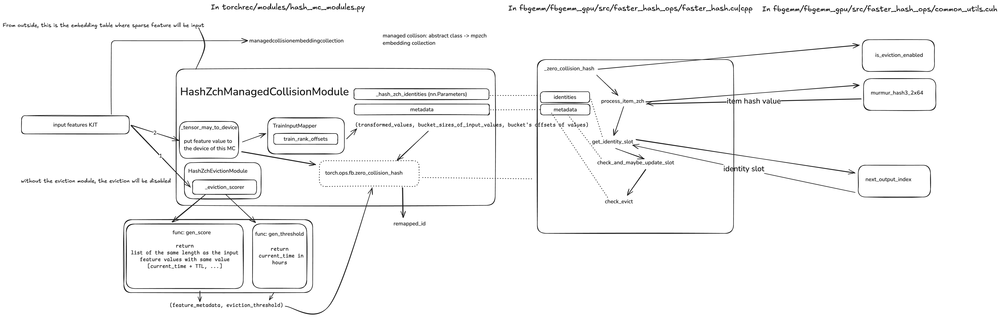

# Managed Collision Hash Example

This example demonstrates the usage of managed collision hash feature in TorchRec, which is designed to efficiently handle hash collisions in embedding tables. We include two implementations of the feature: sorted managed collision Hash (MCH) and MPZCH (Multi-Probe Zero Collision Hash).

## Folder Structure

```
managed_collision_hash/
├── Readme.md           # This documentation file
├── __init__.py         # Python package marker
├── main.py             # Main script to run the benchmark
└── sparse_arch.py      # Implementation of the sparse architecture with managed collision
└── zero_collision_hash_tutorial.ipynb           # Jupyter notebook for the motivation of zero collision hash and the use of zero collision hash modules in TorchRec
```

### Introduction of MPZCH

Multi-probe Zero Collision Hash (MPZCH) is a technique that can be used to reduce the collision rate for embedding table lookups. For the concept of hash collision and why we need to manage the collision, please refer to the [zero collision hash tutorial](zero_collision_hash_tutorial.ipynb).

A MPZCH module contains two essential tables: the identity table and the metadata table.
The identity table is used to record the mapping from input hash value to the remapped ID. The value in each identity table slot is an input hash value, and that hash value's remmaped ID is the index of the slot.
The metadata table share the same length as the identity table. The time when a hash value is inserted into a identity table slot is recorded in the same-indexed slot of the metadata table.

Specifically, MPZCH include the following two steps:
1. **First Probe**: Check if there are available or evictable slots in its identity table.
2. **Second Probe**: Check if the slot for indexed with the input hash value is occupied. If not, directly insert the input hash value into that slot. Otherwise, perform a linear probe to find the next available slot. If all the slots are occupied, find the next evictable slot whose value has stayed in the table for a time longer than a threshold, and replace the expired hash value with the input one.

The use of MPZCH module `HashZchManagedCollisionModule` are introduced with detailed comments in the [sparse_arch.py](sparse_arch.py) file.

The module can be configured to use different eviction policies and parameters.

The detailed function calls are shown in the diagram below


#### Relationship among Important Parameters

The `HashZchManagedCollisionModule` module has three important parameters for initialization
- `num_embeddings`: the number of embeddings in the embedding table
- `num_buckets`: the number of buckets in the hash table

The `num_buckets` is used as the minimal sharding unit for the embedding table. Because we are doing linear probe in MPZCH, when resharding the embedding table, we want to avoid separate the remapped index of an input feature ID and its hash value to different ranks. So we make sure they are in the same bucket, and move the whole bucket during resharding.

## Usage
We also prepare a profiling example of an Sparse Arch implemented with different ZCH techniques.
To run the profiling example with sorted ZCH:

```bash
python main.py
```

To run the profiling example with MPZCH:

```bash
python main.py --use_mpzch
```

You can also specify the `batch_size`, `num_iters`, and `num_embeddings_per_table`:
```bash
python main.py --use_mpzch --batch_size 8 --num_iters 100 --num_embeddings_per_table 1000
```

The example allows you to compare the QPS of embedding operations with sorted ZCH and MPZCH. On our server with A100 GPU, the initial QPS benchmark results with `batch_size=8`, `num_iters=100`, and `num_embeddings_per_table=1000` is presented in the table below:

| ZCH module | QPS |
| --- | --- |
| sorted ZCH | 1371.6942797862002 |
| MPZCH | 2750.4449443587414 |

And with `batch_size=1024`, `num_iters=1000`, and `num_embeddings_per_table=1000` is

| ZCH module | QPS |
| --- | --- |
| sorted ZCH | 263827.54955056956 |
| MPZCH | 551306.9687760604 |
