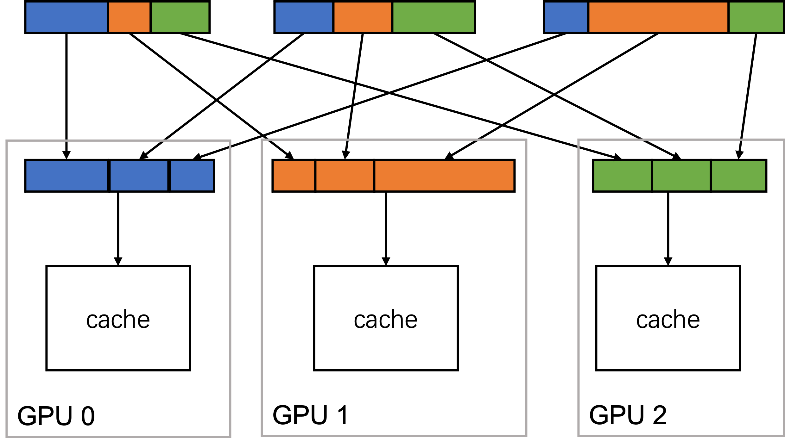
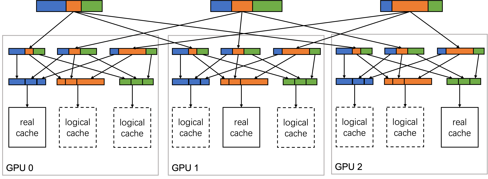

# RFC: Dynamic Embedding with PS

Authors: Zilin Zhu (zilinzhu@tencent.com), Jiayi Feng (jiayifeng@tencent.com), Yang Yu (josephyu@tencent.com)

**NOTE**: This is an early draft of the proposed feature and the main focus is to make developers interested form ideal APIs and implementation for this feature (dynamic embedding). Therefore, the current doc may not conform to a certain RFC format at the moment, e.g. https://github.com/pytorch/rfcs/blob/master/RFC-0000-template.md

## Summary
In a social media scenario, it is common that the feeds to recommend and the number of users keep growing. As a result, users of TorchRec would expect their recommender system support training without estimating the upper bound of the number of feeds in advance. We would call the feature to support growing embedding size as dynamic embedding.

We propose to solve dynamic embedding by attaching an external parameter server (PS) to TorchRec. TorchRec would automatically push/pull the features to/from PS during training. We also propose certain APIs for dynamic embedding, so that TorchRec could pipeline the network communication with the model computation and achieve maximum performance. 

## Background
With the rapid development of social media, recommender systems face a new challenge – the number of feeds to recommend grows daily and it is hard to train models with a fixed size embedding. Therefore, we propose a new feature to help companies train large recommendation models with dynamic embedding support and great performance.

## APIs

We propose a wrapper API that could allow us to change the model and data loader together:

```python
with torchrec.contrib.DynamicEmbedding(
    model,
    data_loader,
    remote="redis://xxx.xxx.xxx.xxx:x/",
    num_prefetch=3,
    evict_num_rows_ratio=0.25,
    ...
) as model, data_loader:
  # just use `model` and `data_loader` as usual.
  ...
```

The reason for this integrated APIs is that the dynamic embedding feature needs to access both the data loader and the model to do prefetch correctly and efficiently. For more details, please check the rationale section.
Rationale
There are several characteristics for most applications of growing embedding:

1. Hard to speculate on the growth speed of the application and the growth speed may greatly fluctuate, e.g., certain hotspots may result in millions of new feeds within minutes.
2. Most embedding features are never accessed a few days after creation. And old features could be re-initialized if only accessed after a long period. This results in a dynamic hot cold separation of the features.
3. Online training matters. Users may hope to push the model trained with data of hotspots to the inference side within minutes so that their users could enjoy the most up-to-date content.

From the above characteristics, it is hard to support dynamic embedding by starting training with a larger GPU cluster. The problem with this solution is that it is hard for users to estimate the size of the cluster to prevent a waste of resources and crash at the same time. Therefore, we propose to introduce an interface in TorchRec to allow attaching external storage components. Specifically, we suggest adding support for attaching PS to TorchRec cluster for several reasons:

1. The remote PS and the embedding of TorchRec clusters form a hot-cold separation of the features naturally.
2. There are mature industrial solutions for CPU PS that could support nearly unlimited storage and quickly send the training model weight to inference.
3. PS could decouple the training and inference process, making it possible to migrate to TorchRec incrementally.
4. The cost of CPU PS is normally much lower than GPU servers.

**NOTE**: The PS here is only responsible for storing the embedding features, similar to KV storage like redis. All the model training computations (forward, backward, and optimizer) are done within the TorchRec GPU cluster.

Under such a setting, the distributed embedding in GPU clusters would serve as a cache of the whole system. For each feature, it will have a `global_id`, representing its id in PS, and if it is currently stored in GPU embedding, a `cache_id`, representing its id in the GPU embedding. When a new data sample arrives, it needs to convert the `global_id` to `cache_id` and update the “cache” if necessary. The following is pseudocode of the preprocessing method:

```python
def preprocess(global_id):
    if global_id in cache_index:
        cache_id = cache_index[global_id]
    else:
        if cache_index.full():
           # push the old features back to PS
           evict(cache_index, embedding)
        cache_id = cache_index.get_available_cache_id()
        # fetch the feature from PS and insert to the
        # corresponding position in embedding
        insert(cache_index, embedding, cache_id)
    return cache_id
```

**NOTE**: The above code snippet is only for showing the possible procedures involved, the real implementation should work in a more performant way.

To implement this architecture, we need to clarify some implementation details:

1. How to move the features fetched from PS into GPU embedding?

    Because TorchRec supports multiple sharding schema, different segments of an embedding feature may be stored on different devices, when given a `cache_id`, we need to cut it into segments and move those segments to their actual locations in the ShardedTensor.
    We may store features in PS according to the sharding schema, i.e. save segments of the feature separately, so that each device can only fetch the segment that will be in its shard.

2. How to have a consistent cache index across devices?

    During training, the same `cache_id` on different devices must be storing the feature with the same `global_id`. To ensure strong consistency, we could use let each device only maintain the cache info of the features that are stored locally, and communicate with other devices if cache info of other features is needed.

    

    In the illustration above, each GPU gets a different data sample (data-parallel training), and each data sample has some ids that should be stored on GPU 0, 1, and 2 (represented by blue, orange, and green). We could first use an all-to-all operation to gather all ids with the same color to its corresponding GPU so that each GPU could deal with their ids. And after updating the cache, we could use another all-to-all operation to scatter the ids back (not drawn in the above illustration).

    **NOTE**: The actual cache calculation may be done on the CPU. GPU 0, 1, and 2 here merely represent the shardings.

    The 2 unbalanced all-to-all may become a bottleneck of the system. We also proposed another design to reduce the communication:

    

    In the illustration above, all devices will first allgather the data. After obtaining all data in this step, we could simulate the changes in the cache of remote PS with a logical cache. Therefore, we could start 3 caches on each device, while only 1 of the 3 will update the embedding, the other ones are simulators. With these simulators, we no longer need to use another all-to-all operation to scatter the ids. And the allgather communication will be more balanced.

    These 2 approaches are a trade-off between network communication and computation. It is worth mentioning that the latter approach is more complex. And the second all-to-all operation in the first approach could be concurrent with the fetching from PS to GPU cluster.

3. Will there be intrusive modifications to TorchRec?

    To implement prefetching, i.e. preprocessing future data while training on the current ones, we need a synchronization mechanism. This is because we need to know which data are ready to train and which have finished training (ready to evict). Also, we could postpone the synchronization of fetching to just before calling `forward` on embedding modules. We may register hooks to the DMP model.
