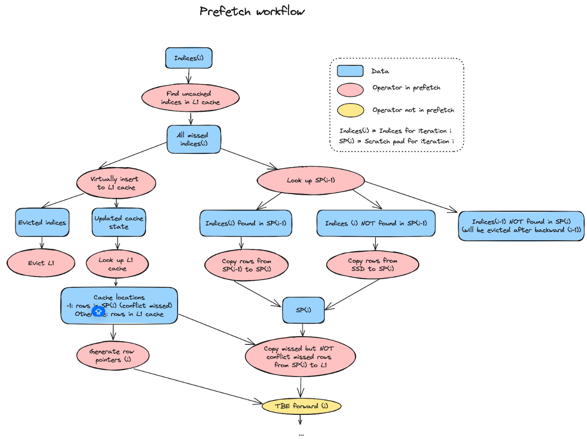

# KV storage extension Design for TBE; SSD and PS Examples

Sarunya Pumma, Emma Lin, Ehsan K. Ardestani, Joe Wang

# Design Principles

1) Extend current TBE: There is considerable effort and expertise which has gone toward enabling performance optimized TBE for accessing HBM as well as host DRAM. We want to leverage such capabilities, and extend on top of TBE.
2) Abstract out the details of the backend memory: The memory we use could be SSD, Remote memory tiers through back end, or remote memory through front end. We want to enable all such capabilities, without adding backend specific logic to the TBE code.

# High Level Design

Considering design principles listed above, we have opted on a Key-Value API. TBE will offer a software managed cache in HBM, as we do when leveraging the host side memory. However, unlike extension to host side memory where we leverage UVA to prefetch, currently we opt for a copy based API, mandated by design rule \#2, to separate the implementation of the backend KV store, and TBE. It is possible that in future we might adopt a UVA based command queue approach interface with the KV-store, if the cost of the copy based semantics proves prohibitive.
[![image1]](./kv_tbe_training_high_level.png)

Figure 1: High level architecture of TBE KV Store based extension. The blocks with orange line are implemented by TBE.

The prefetch access to the KV store happens through [*get\_cuda*](https://github.com/pytorch/FBGEMM/blob/main/fbgemm_gpu/fbgemm_gpu/tbe/ssd/training.py#L1455) and [*set\_cuda*](https://github.com/pytorch/FBGEMM/blob/main/fbgemm_gpu/fbgemm_gpu/tbe/ssd/training.py#L1012) methods (APIs), which in turn use *cudaStreamAddCallback to maintain the execution order and call on the backend implementation of get and set.*

We only allow access to the KV Store by TBE through *prefetch* API. The TBE forward and backward methods only operate on HBM or DRAM through UVA.

The Auxiliary buffers indicated in Figure 1 provide a scratch pad to stage the data from KV store to GPU, and from GPU to KV Store (eviction).

# Implementation

We do expect a training pipeline similar to EMO-DRAM to allow for overlapping prefetch(i+1) with train(i), where (i) denotes a training iteration number. This requires some extra work on the train pipeline to enable prefetch pipeline on top of SSD pipeline.  The high-level workflow of pipeline prefetching is shown in the figure below.

[![image2]](./kv_tbe_pipeline_prefetching.png)

# Handling Conflict Miss

We introduced a UVA scratch pad buffer (which can be accessed by both device and host) for storing L1 conflict missed rows (the missing rows that cannot fit in L1 due to a lack of enough associativity).  Moreover, we use the scratch buffer for staging data when fetching it from the backend storage (SSD or L2) into L1 for the rows that are missed but can be inserted into L1.  The TBE forward and backward kernels access L1 if rows are in cache, otherwise access the scratch pad.  This would be similar to handling conflict misses in EMO-DRAM (UVM\_Caching).

# Ensuring Coherence

The training stream only accesses HBM and scratch pad (UVA) buffers. The access to the KV Store only happens during prefetch. This simplifies maintaining coherence among the training stream and prefetch stream.

Similar to EMO+DRAM:

1. We do enforce ordering between prefetch(i+1) and TBE backward(i), as the prefetch(i+1) can occur after prefetch(i) and needs to finish before the TBE backward(i). As a result, we have to ensure Read After Write (RAW) is maintained for *Batch i* rows that are present in the scratch pad (UVA) buffer (due to conflict), and the *Batch i+1* rows that are prefetched. This means the L1 cache updates due to prefetch need to be visible to TBE backward.
2. Currently, a scratch pad only holds data for each iteration.  It is allocated/populated during prefetch and evicted/deallocated after the backward pass of TBE is complete.  To avoid evicting and re-fetching the rows that are used by two consecutive iterations, TBE looks up the SP(i) (the scratch pad of iteration i) during prefetch(i+1). It ensures that overlapping rows are moved to SP(i+1) safely by updating the locations (pointers) of rows in iteration i.
3. To guarantee that L1 cache lines are not being prematurely evicted, we lock them when they are being used (as soon as they are being inserted) and unlock them after their usage is complete (after each TBE backward iteration).  When a cache line is locked, it cannot be evicted.
4. Only support prefetch distance \= 1
5. The user must ensure that prefetch(i) is invoked before forward(i)

The detailed prefetch workflow is demonstrated in the figure below.

TBE will ensure a unified UVA buffer across prefetch and eviction flows.

# Concurrency of Prefetch and Training stages

None of the functions in prefetch stream are blocking the GPU training stream. This includes the memory copy and the get/set function calls to access the row in the KV store.

- The ssd\_cache\_populate does consume SM hence impacting the performance of kernels on the training stream. However, we expect these kernels to be quick
- The D2H to transfer the inserted\_indices (keys) to the host side for get\_cuda call is nonblocking. The ordering between the host call and the kernels on the prefetch stream is ensured through cudaStreamAddCallBack semantic which ensures the call back to the backend implementation is made once all the previously submitted kernels in the stream are finished.
- get\_cuda will delegate the fetching of rows to the backend get function through host call back (running on another CPU thread), and does not block GPU. We expect the get to be the longest function, and if not fully overlapped with training (dense FWD and BWD for example in sync training), will impact the end to end performance.
- set\_cuda will delegate eviction of the rows to the backend set function through host call back, and does not block GPU.  Moreover, the memory copy of the evicted\_indices is done on the evict stream.  Thus, it does not block the training stream
- The masked\_index\_put/masked\_index\_select functions need a limited number of SMs to ensure it can saturate the GPU to CPU bandwidth as it moves embedding rows from scratch pad buffers to the emb L1 cache.

# SSD backend

One of the backends to extend the memory beyond host DRAM is the SSDs our AI HW offer. Using SSD introduces the range of constraints:

- Access to SSDs are not byte level. Many SSDs have designs around 4K access granularity. This could result in read or write amplifications when the access data size is smaller than 4K.
- SSD bandwidth is 1-2 orders of magnitude lower than host DRAM, which itself is typically 1-2 orders of magnitude slower than HBM.
- SSDs wear as data is written into them. Typically, SSDs have 3-5 pDWPD (physical write per day) guarantee for 3-5 years. This means a 4TB SSD with 5 pDWPD in 5 years, can sustain daily writes of 20TB per day for 5 years.

For KV Store implementation, we opted for leveraging RocksDB instead of building the stack from scratch. The main features of RocksDB for our decision are:

- RocksDB is a KV store
- RocksDB addresses write amplification by consolidating writes in a contiguous space, and updating the mapping
- RocksDB provides in memory structures to accelerate access to SSD.

[RocksDB](https://github.com/facebook/rocksdb/wiki/Basic-Operations) provides the basic KV store APIs for read (Get, MultiGet) and write(Put, WriteBatch), which is leveraged by the [EmbeddingRocksDB](https://github.com/pytorch/FBGEMM/blob/main/fbgemm_gpu/src/ssd_split_embeddings_cache/ssd_table_batched_embeddings.h#L76) class.

## Supported for raw ID indexing

With KV API, we can support using raw IDs when the embeddings are mapped to the KV Store. This means the solution can provide the benefit of Zero Collision Hashing (ZCH) like approaches natively.

# Persisting

One main challenge to be addressed when tensors are stored in SSD is the fact that we cannot simply pass a tensor in response to *state\_dict* API. Given the KV store backend, we need to materialize the tensor in memory chunk by chunk.

## Partial Tensor copy Support

Current proposal is to leverage *tensor.narrow* to get a subset of tensor to allow for handling of very large tensors with small persisting buffers. For Embedding with KV backend, under the hood, TBE with need to provide a handle, implementing at least the following APIs:

- *Narrow*: This API will provide a chunk of the underlying embedding, given the offset and size. The corresponding keys need to be read, and copied into a tensor, and passed to the caller.
- *View*: This is to ensure we have a linear view of the tensor. Note that the underlying tensor we support has dim \[hash\_size, emb\_dim\]. The override can only implement view for bytes, numel, or em\_dim.
- *Element\_size, Numel, nbytes:* to provide the meta data on the size of the underlying tensor sp the caller can perform book keeping
